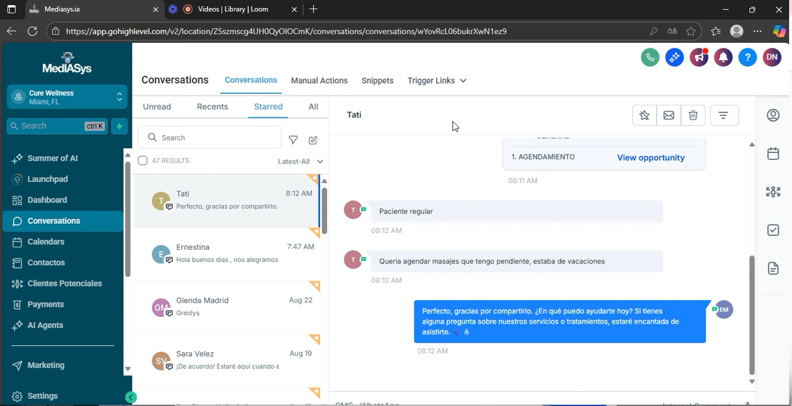
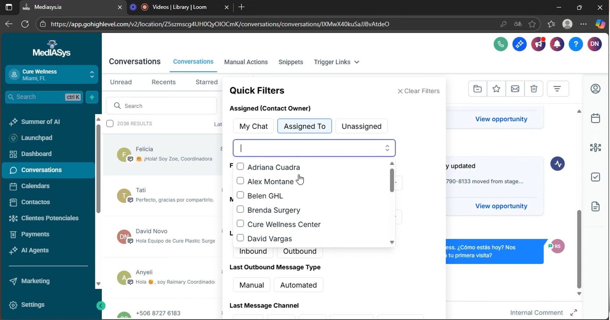
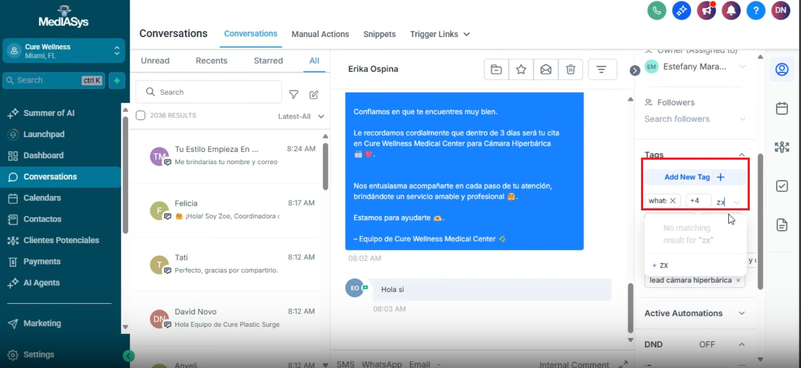

# Procedimiento Operativo Estándar para el Uso de la Herramienta de Conversaciones

## Objective

Este SOP tiene como objetivo guiar a los miembros del equipo en el uso eficiente de la herramienta de conversaciones, optimizando la gestión de chats y citas.

<iframe src="https://www.loom.com/embed/004182df401b47a9932e0def15bfa622?sid=83f0d670-da75-4925-b90b-5c88599dbb4e" frameborder="0" webkitallowfullscreen mozallowfullscreen allowfullscreen style="position: absolute; top: 0; left: 0; width: 100%; height: 100%;"></iframe>

# Key Steps
 
## 1. Acceso a la Sección de Conversaciones 0:01

Inicia sesión en la herramienta.
Navega a la sección de 'Conversaciones'.
Aquí podrás ver todos los chats disponibles.
 
## 2. Uso de Filtros en Conversaciones 0:27

Utiliza el filtro de estrella para marcar conversaciones importantes.
Filtra chats por nombre (ejemplo: 'Jessica') para ver solo las interacciones relevantes.
 
## 3. Filtrado por Mensajes 1:38

Filtra los mensajes por tipo: entrante o saliente.
Esto ayuda a reducir el spam y a mantener la claridad en las comunicaciones.
 
## 4. Búsqueda de Conversaciones 2:12

Usa la barra de búsqueda para filtrar por palabras clave, nombres o números de teléfono.
Por ejemplo, busca 'cámara' para encontrar información relacionada con procedimientos específicos.
 
## 5. Creación y Gestión de Etiquetas 2:55

Para crear nuevas etiquetas, ingresa el nombre y presiona ENTER.
Para eliminar etiquetas, haz clic en la 'X' correspondiente.
 
## 6. Cambio de Estado de Conversaciones 4:12

Cambia el estado de las conversaciones desde el CRM de agendamiento.
Mueve el estado manualmente según sea necesario y presiona 'update'.
 
## 7. Adición de Notas a Chats 4:48

Si un chat no tiene notas, puedes agregar información relevante sobre el paciente.
Anota detalles importantes como la fecha de la cita o cualquier comentario especial.

## Cautionary Notes

Asegúrate de no mezclar conversaciones de diferentes pacientes para evitar confusiones.
Revisa las etiquetas antes de eliminarlas para no perder información importante.

## Tips for Efficiency

Utiliza los filtros y la búsqueda para encontrar información rápidamente.
Mantén las notas actualizadas para facilitar el seguimiento de los pacientes.
Revisa regularmente las conversaciones marcadas con estrella para no olvidar interacciones importantes.
