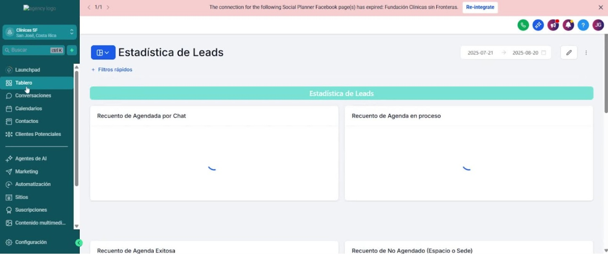
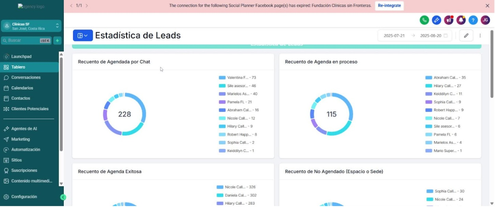
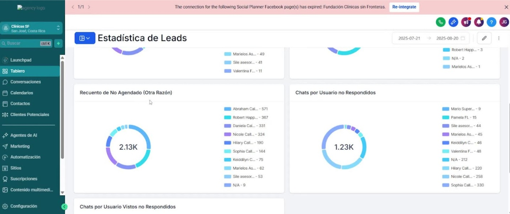

# Procedimiento Operativo Estándar para el Uso del Tablero

## Objective

Este SOP proporciona una guía clara y concisa sobre cómo utilizar el módulo de Tablero para analizar datos de leads y su estado en el pipeline.

<iframe src="https://www.loom.com/embed/159dc9aebb96419dbcd344580ace35c6?sid=bd9e33d1-85fc-4245-94cb-4074b2c406ce" frameborder="0" webkitallowfullscreen mozallowfullscreen allowfullscreen style="position: absolute; top: 0; left: 0; width: 100%; height: 100%;"></iframe>

## Key Steps

### 1. Acceso al Módulo de Tablero 0:01

- Iniciar sesión en la página principal.
- Dirigirse al módulo de Tablero en la parte izquierda de la pantalla.

### 2. Visualización del Dashboard 0:19

- Observar el dashboard que muestra la analítica de procesos según el pipeline.
- Identificar el conteo total de leads en el estado de 'Agendado por Chat'.

### 3. Filtrar Leads por Asesor 0:35

- Seleccionar el asesor deseado (ejemplo: Valentina).
- Hacer clic en el color correspondiente al asesor para ver los leads asignados.

### 4. Recuento de Agenda en Proceso 1:32

- Acceder a la analítica de 'Agenda en Proceso'.
- Filtrar por asesor (ejemplo: Abraham) para ver el total de leads.

### 5. Recuento de Agenda Exitosa 2:21

- Seleccionar la opción de 'Agenda Exitosa'.
- Filtrar por asesor (ejemplo: Nicole) para ver el total de leads exitosos.

### 6. Recuento de No Agendado 3:13

- Acceder a la analítica de 'No Agendado'.
- Filtrar por usuario para ver los leads no agendados.

### 7. Chats No Respondidos 3:35

- Revisar la analítica de 'Chats No Respondidos'.
- Identificar leads que tienen notificaciones activas y no han sido respondidos.

### 8. Chats Vistos pero No Respondidos 4:29

- Acceder a la analítica de 'Chats Vistos pero No Respondidos'.
- Revisar los leads que han sido vistos pero no respondidos.

### 9. Análisis por Fechas 5:18

- Seleccionar el rango de fechas deseado para el análisis.
- Confirmar las fechas para obtener la analítica correspondiente.

### 10. Generación de Reportes por Periodo 6:57

- Elegir el periodo deseado (ejemplo: últimos siete días, este mes, etc.).
- Confirmar para visualizar los datos del periodo seleccionado.

## Cautionary Notes

- Asegúrate de seleccionar correctamente los asesores y las fechas para evitar confusiones en los datos.
- Verifica que los filtros aplicados sean los correctos antes de analizar los resultados.

## Tips for Efficiency

Utiliza los filtros de manera efectiva para reducir el tiempo de búsqueda de información específica.
Familiarízate con los colores asignados a cada asesor para una navegación más rápida.
