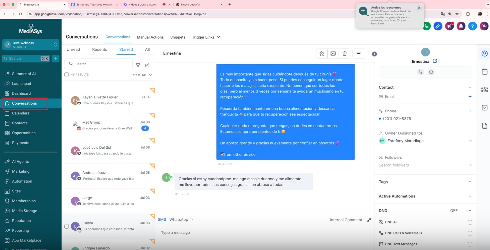
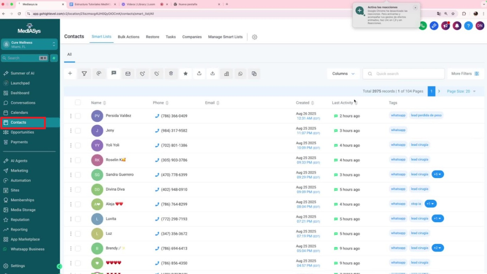

# Introducción
Este SOP proporciona una guía clara y concisa sobre cómo navegar y utilizar las funciones principales del sistema Mediasis para la gestión de contactos, conversaciones y oportunidades.

# Key Steps

<iframe src="https://www.loom.com/embed/f3a3c0ac449f479181aaf811fc2fcb27?sid=0b08614c-ebbd-40bc-9324-9f6298862869" frameborder="0" webkitallowfullscreen mozallowfullscreen allowfullscreen style="position: absolute; top: 0; left: 0; width: 100%; height: 100%;"></iframe>

## 1. Introducción al Sistema MedIASys

- Bienvenida al video introductorio sobre Mediasis.
- Familiarización con las herramientas y funciones principales del sistema.

## 2. Navegación en el Dashboard

- Acceder al menú izquierdo para visualizar el Dashboard.
- Personalizar el Dashboard según las necesidades de la clínica (datos diarios, volumen, asignaciones, etc.).

## 3. Gestión de Conversaciones 1:37

- Revisar todas las conversaciones entrantes desde diferentes canales (Instagram, WhatsApp Business, Messenger, etc.).
- Utilizar el globito correspondiente para identificar el canal de origen.

## 4. Creación y Personalización de Calendarios 2:45

- Acceder a la sección de calendarios.
- Crear y personalizar calendarios según la disponibilidad y necesidades.
## 5. Visualización de Contactos 3:25

- Acceder a la sección de contactos para visualizar todos los registros del sistema.
- Revisar los canales de comunicación asociados a cada contacto.

## 6. Manejo de Oportunidades (CRM) 3:47

- Acceder a la sección de oportunidades para gestionar leads.
- Personalizar el CRM según las necesidades específicas de la clínica.

## 7. Uso de Funciones Principales 5:30

- Enfocarse en las funciones más utilizadas: Dashboard, Conversaciones, Calendarios y Oportunidades.

## 8. Soporte y Consultas 6:13

Contactar al equipo de soporte a través del canal habilitado en WhatsApp para resolver dudas.

